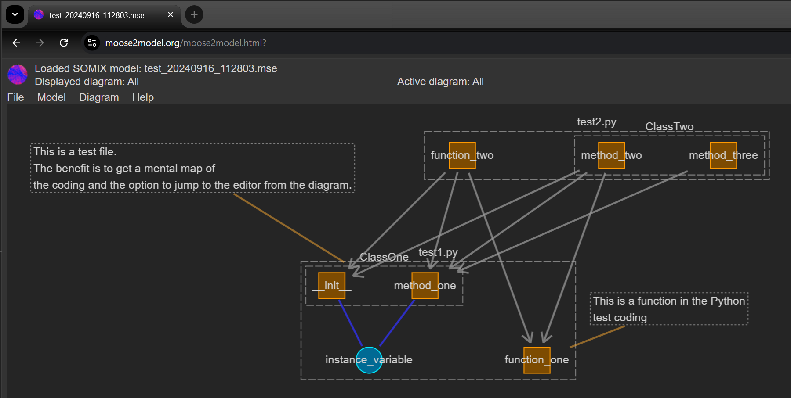

# Python2SOMIX
Extract SOMIX model from Python code

## What is it for?

It allows to visualize Python code and the relations due to calls, accesses and grouping.

Example, there are two Pythond files

test1.py
```python
# test1.py remains unchanged
class ClassOne:
    class_variable = 100

    def __init__(self):
        self.instance_variable = 0
        ClassOne.class_variable += 1  # Fixed class variable increment

    def method_one(self):
        self.instance_variable += 1
        print("ClassOne method_one called")

def function_one():
    print("function_one called")
```
test2.py
```python
# Updated test2.py with type annotations
from test1 import ClassOne, function_one

class ClassTwo:
    def method_two(self):
        obj = ClassOne()
        obj.method_one()
        function_one()
        print("ClassTwo method_two called")

    def method_three(self, my_obj: ClassOne):
        # To check that usage is also found when ClassOne is passed as an argument
        my_obj.method_one()

def function_two():
    obj = ClassOne()
    obj.method_one()
    function_one()
    print("function_two called")
```
You can use the extracted mse file to display diagram in Moose2Model. 
Go to www.moose2model.org to do this. This website uses only simple JavaScript coding and can also be run locally.



## How to run
start the script in the terminal with 
```batch
python .\python2mse.py
```
The script will ask for the path to the folder where the python code is saved.

You may place a configuration file in the same folder as python2mse.py to specify which folder is to be read and where the output file is to be placed:

Exact name of the file: config_python2mse.txt

```batch
# Configuration file
base_path=/path/to/your/base/folder
output_path=/path/to/output/directory
```
To find usages of methods when the instance is passed to a parameter, you have to annotate the import parameter (Here that is belongs to ClassOne):

```python
    def method_three(self, my_obj: ClassOne):
        # To check that usage is also found when ClassOne is passed as an argument
        my_obj.method_one()
```
## Automatic test

Do an automatic test with 

```batch
...\Python2SOMIX\src> python .\test_extraction.py
```

This test generates the subfolder test with test coding and compares the expected mse file expected_output.mse with the extracted file test(date_time).mse.
Adapt this coding when the logic is changed. The test ignores the exact order of entries and the exact value of the id.

## Documentation

See [/src/documentation.md](https://github.com/Moose2Model/Python2SOMIX/blob/main/src/documentation.md).
